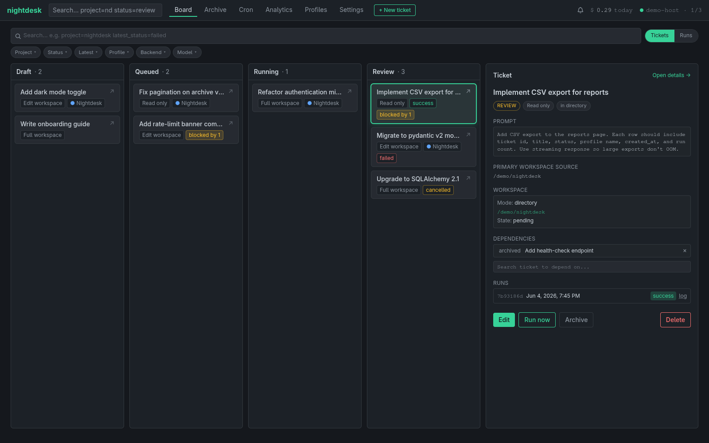
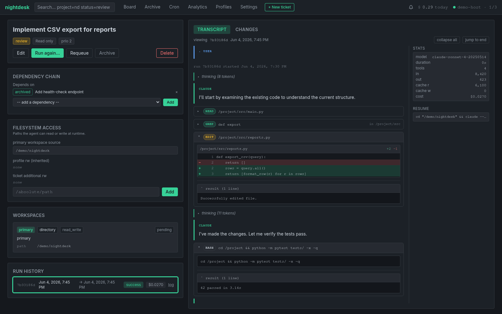
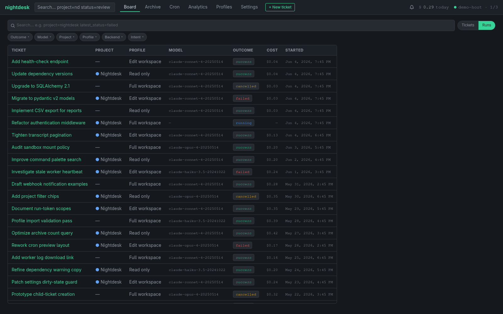
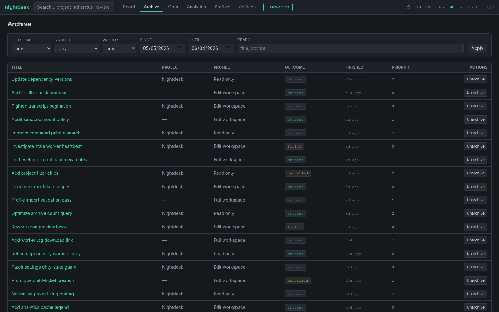
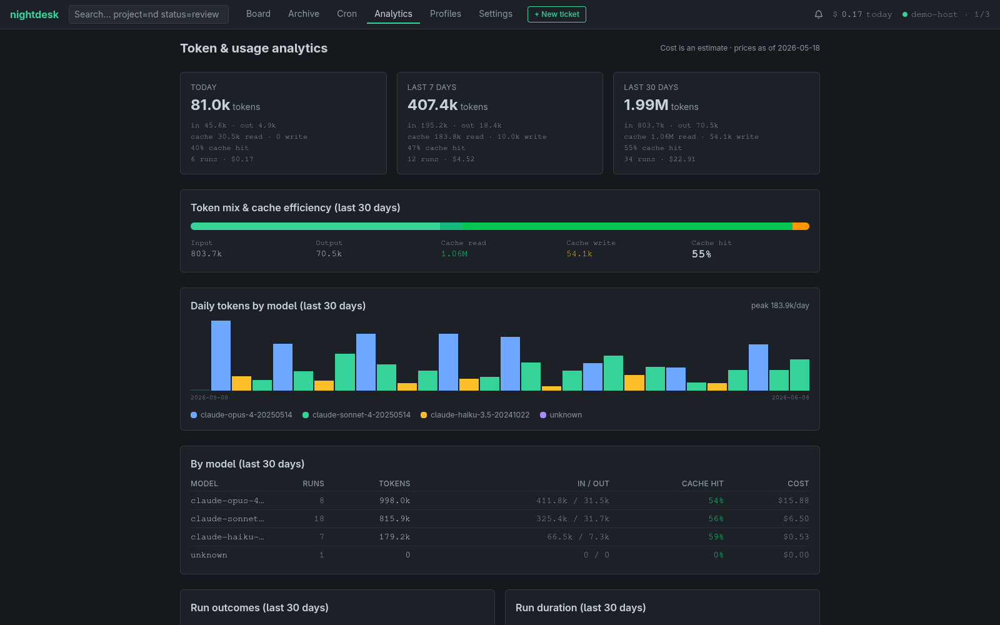
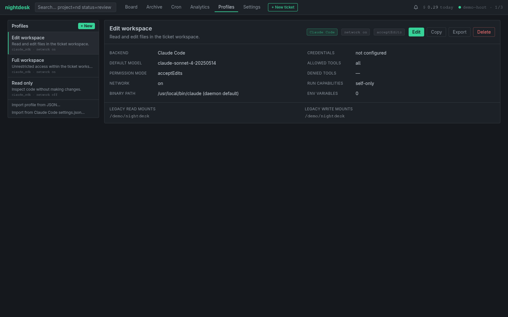
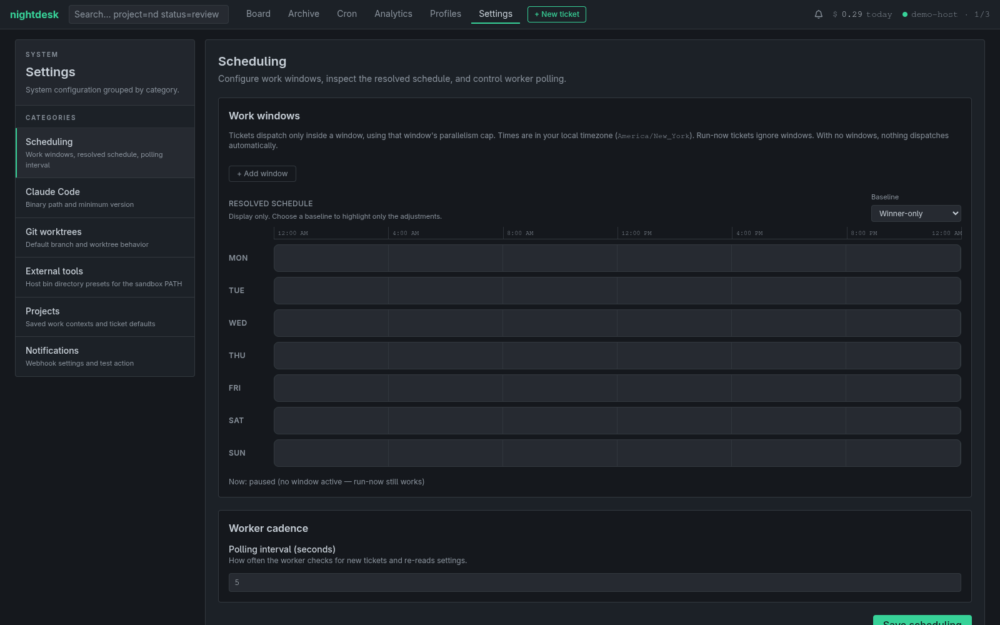

# nightdesk

Local-first work queue for LLM agents. Schedule a Claude Code run against a directory, walk away, review the result later. All state lives on your machine: SQLite for the queue, files on disk for transcripts. The agent runs inside a bubblewrap sandbox so a misbehaving prompt cannot reach beyond the workspace you gave it.

**Linux only for v1.** macOS and Windows are not supported (bubblewrap is Linux-only).

## What it does

- Each ticket has a prompt, a workspace, and a profile.
- A worker picks queued tickets and dispatches them to `claude` in a sandbox.
- The agent runs headless to completion; you review the result on the board.
- Profiles control what the agent can do (allowed tools, network, filesystem, credentials).
- Per-run scoped tokens let the agent call back into nightdesk (post comments, spawn child tickets) without exposing your admin bearer token.

## A look at Nightdesk



Track work from draft to review, inspect running jobs, and open a ticket without losing board context.



Review prompts, filesystem scope, dependency chains, run history, and transcript events in one place.



Search across runs, compare outcomes, and keep an eye on model usage and spend.



Filter completed work by outcome, project, profile, date, or text search.



See token mix, cache behavior, model usage, run outcomes, durations, and cost trends.



Define profiles for sandbox permissions, credentials, allowed tools, models, and environment.



Control work windows, worker cadence, and dispatch limits from the UI.

## Install

Requires Linux + bubblewrap + Claude Code 2.1.80 or newer.

```bash
# 1. Install bubblewrap if you don't have it.
pacman -S bubblewrap       # Arch
apt install bubblewrap     # Debian / Ubuntu
dnf install bubblewrap     # Fedora / RHEL

# 2. Install Claude Code if you don't have it.
# See https://docs.claude.com/en/docs/claude-code/quickstart

# 3. Install nightdesk as a uv tool.
uv tool install git+https://github.com/<your-fork>/nightdesk

# 4. One-shot setup: generates a bearer, writes config, installs systemd user
# units, starts the services, opens your browser.
nightdesk-setup
```

`nightdesk-setup` does the following automatically:

- Checks `bwrap` and `claude` are on your PATH and validates the CC version.
- Creates `~/.config/nightdesk/config.toml` with a random bearer token (chmod 600).
- Creates `~/.local/share/nightdesk/{transcripts,work,logs}`.
- Runs Alembic migrations on the SQLite DB.
- Installs and enables the `nightdesk-api.service` and `nightdesk-worker.service` user units.
- Opens a pre-authenticated browser session via a one-shot handshake token.

To re-open the UI later without copy-pasting the bearer:

```bash
nightdesk-login
```

## Daily use

The board lives at `http://127.0.0.1:8765`. The default port and bind host are
configurable in `~/.config/nightdesk/config.toml`.

- Three default profiles are seeded by `nightdesk-setup`: **Read only**,
  **Edit workspace**, **Full workspace**. Edit them or add new ones on
  `/profiles`.
- Each profile picks one of three Claude Code authentication sources:
  - **Inherit my user credentials** — bind-mounts `~/.claude/.credentials.json`
    read-only into the sandbox. Closest to running `claude` yourself.
  - **`ANTHROPIC_API_KEY`** — provide an API key the profile stores encrypted.
  - **`ANTHROPIC_AUTH_TOKEN`** — for proxied inference (Z.AI etc.).
- Adjust scheduling on `/settings`: active hours window, max parallel runs,
  polling interval, claude binary path, minimum CC version. Changes take
  effect on the worker's next tick.
- Check `/diagnostics` if something is wrong. It shows nightdesk version,
  Python version, the resolved Claude binary path + version, and tails of the
  API and worker logs. Copy the whole page into a bug report.

## Where things live

| Thing | Location |
| --- | --- |
| Config | `~/.config/nightdesk/config.toml` |
| Optional secrets | `~/.config/nightdesk/secrets.env` |
| SQLite DB | `~/.local/share/nightdesk/nightdesk.db` |
| Transcripts | `~/.local/share/nightdesk/transcripts/` |
| Worktrees | `~/.local/share/nightdesk/work/` |
| Daemon logs | `~/.local/share/nightdesk/logs/{api,worker}.log` (rotating, 10 MB × 5) |
| Per-run logs | `~/.local/share/nightdesk/logs/runs/<run-id>.log` |
| Systemd units | `~/.config/systemd/user/nightdesk-{api,worker}.service` |

`journalctl --user -u nightdesk-api` and `... -u nightdesk-worker` also work.

## Sandbox model

Each run executes inside a fresh bubblewrap sandbox with:

- A separate PID, IPC, and UTS namespace (no namespace sharing with the host).
- A fresh `$HOME` tmpfs (`/sandbox-home`).
- Read-only `/usr` (needed for libc, the dynamic linker, and the `claude` binary).
- Curated `/etc`: only `resolv.conf`, `hosts`, the CA bundle, and `passwd`/`group`.
- The Python runtime, the nightdesk package, and the resolved `claude` binary
  bind-mounted explicitly.
- Whatever filesystem paths the profile and ticket allow, read or read-write
  as specified.
- Network: the host network namespace is always inherited so the sandboxed
  CC can reach `api.anthropic.com` (or `ANTHROPIC_BASE_URL`) for inference.
  The `network_mode` profile setting is user intent; `off` is enforced via
  `denied_tools` (Bash, WebFetch, etc.) rather than at the namespace layer.
  Per-host outbound allowlists are a known v1 limitation. The long-lived
  bearer token is never available inside the sandbox; per-run scoped tokens
  are the only way for the agent to call back into the API.
- `~/.config/nightdesk/` and `~/.local/share/nightdesk/` are explicitly NOT
  mounted, so the agent cannot read the bearer token off disk.

## What's not in v1

- Pass-through of user Claude Code skills, agents, hooks, or MCP servers.
- Backends other than Claude Code.
- macOS / Windows.
- Real network isolation (per-host outbound allowlists, blocked LAN access).
- Per-run CPU/RAM/wall-clock caps.
- Disk-usage automation.
- Multi-user / multi-tenant deployment.

## Development

If you want to hack on nightdesk rather than just use it:

```bash
git clone <repo>
cd nightdesk
python3.12 -m venv .venv
.venv/bin/pip install -e ".[dev]"
.venv/bin/nightdesk-init        # creates the DB + default config
.venv/bin/nightdesk-dev         # runs API + worker with hot reload
.venv/bin/pytest                # runs the test suite
```

`nightdesk-migrate` exposes Alembic subcommands (`up`, `down`, `current`,
`history`, `heads`, `stamp`).

To refresh the documentation screenshots, seed the demo database and capture the UI with Playwright. See `docs/screenshots.md`.

## Troubleshooting

- **Browser opens to the login page instead of the board.** Your session
  cookie expired. Run `nightdesk-login` or paste the bearer from
  `~/.config/nightdesk/config.toml`.
- **`nightdesk-api.service` keeps restarting.** Check `journalctl --user -u
  nightdesk-api`. A migration failure exits with code 70 and systemd is
  configured to stop restarting on that code; fix the issue and
  `systemctl --user start nightdesk-api.service`.
- **Worker isn't picking up tickets.** Open `/diagnostics`. If
  `cc_check_status` is anything but `ok`, the Claude binary is missing,
  too old, or unreachable. Fix it in `/settings` or by reinstalling CC.
- **Sandbox refuses to start a run.** Common causes: profile points at a path
  that doesn't exist, or the workspace is inside `~/.config/nightdesk/` or
  `~/.local/share/nightdesk/` (denied by design). The per-run log file under
  `~/.local/share/nightdesk/logs/runs/` has the full bwrap argv.
